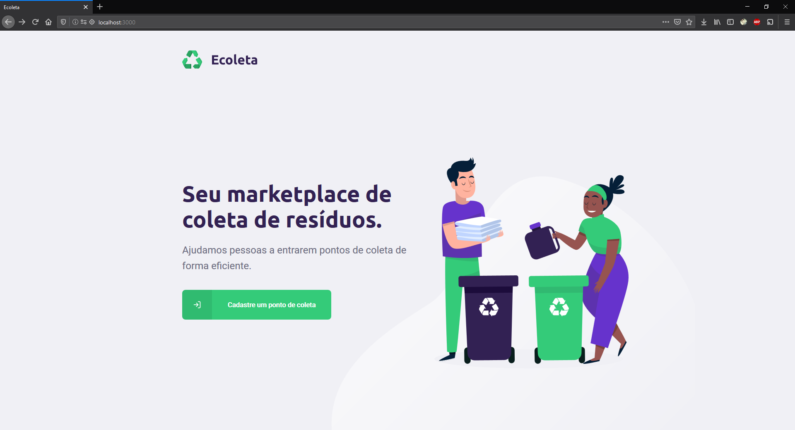
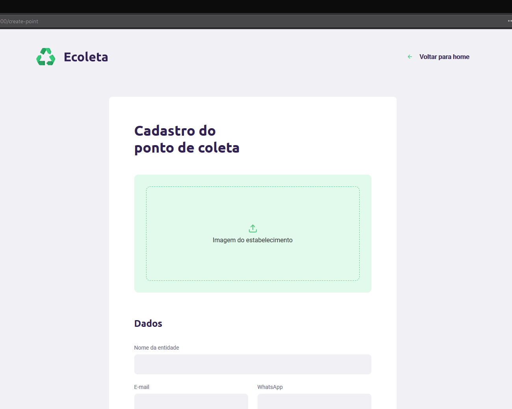
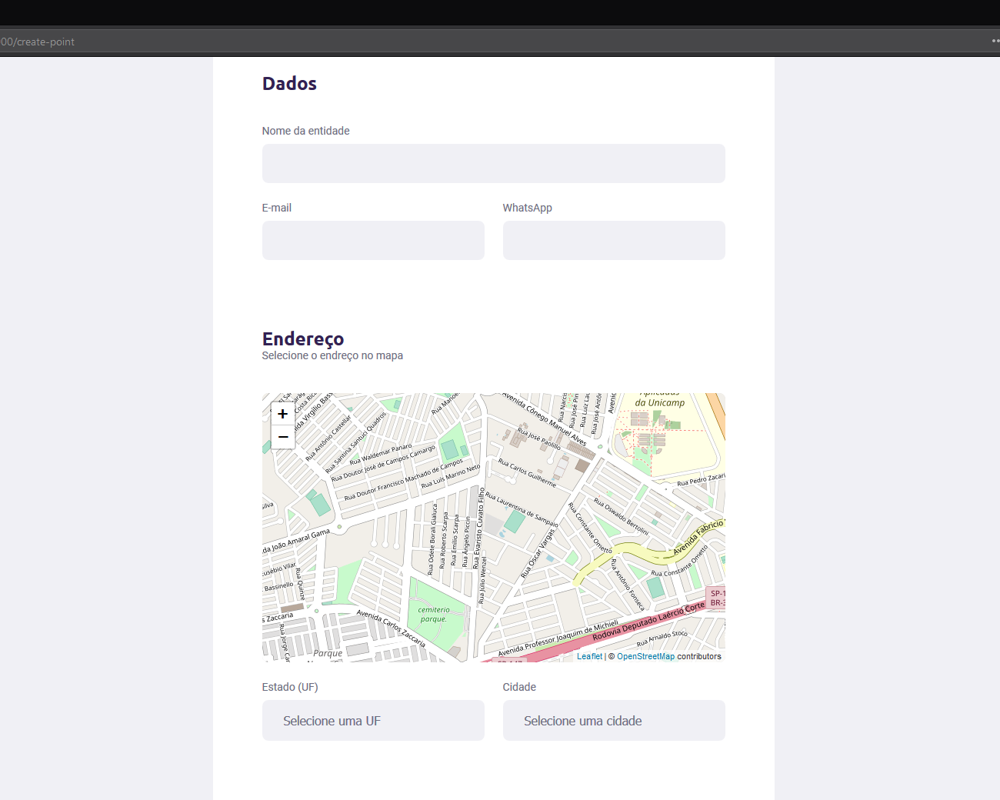
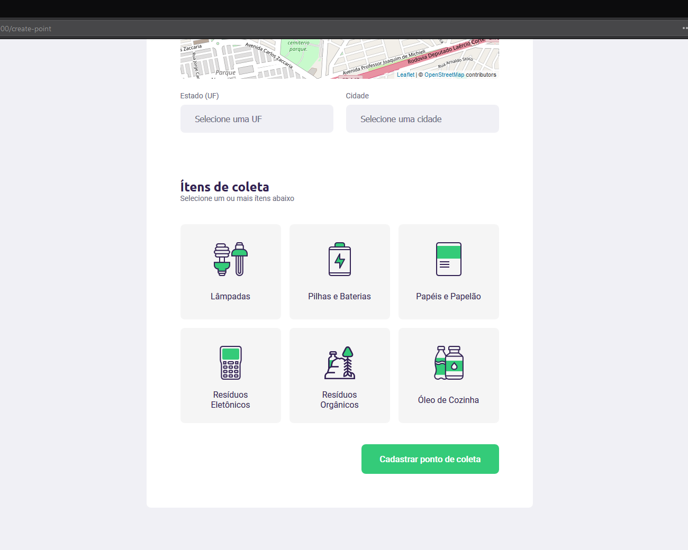
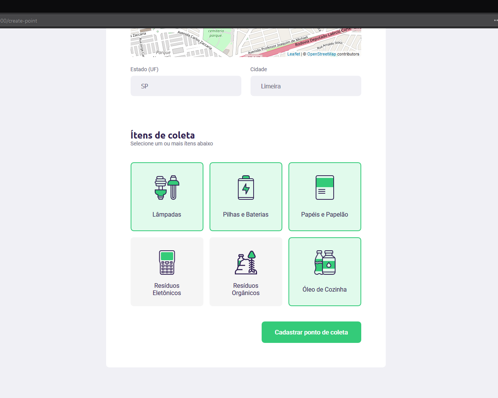

Project created to "Next Level Week" for estudies on:

- Node.js, Express 5, JWT, Helmet, rate limiting (backend)
- SQLite (better-sqlite3), Knex (database)
- React 19, Vite, React Router, React Leaflet, Axios (frontend)
- React Native, Expo SDK 57 (mobile)
- Celebrate/Joi (validations)
- Vitest, Supertest, Testing Library, jest-expo (tests)
- TypeScript

# Cool, but... What is this?
The project helps people find garbage collection locations.

The frontend register the locations through the website and people visit the app, considering contacting via email or whatsapp, and check on the map.

## Backend
Structure with SQLite, RESTful API using Node.js (TypeScript runs natively on Node 24+, no build step).

### Authentication
Users create an account (`POST /users`, password stored as a salted scrypt hash) and log in with `POST /sessions`, which returns a JWT (HS256). Registering, editing or deleting a collection point requires `Authorization: Bearer <token>`, and only the user who created a point can change it:

| Route | Auth |
| --- | --- |
| `POST /users`, `POST /sessions` | public, rate limited |
| `GET /items`, `GET /points`, `GET /points/:id` | public |
| `POST /points` | JWT |
| `PUT /points/:id`, `DELETE /points/:id` | JWT, owner only |

Uploaded images must be JPEG, PNG or WebP up to 5MB. The file content is checked and the file is saved with a random name.

## Frontend
React, Typescript.







## Mobile
Mobile app. Lists collection points and users can view them on the map, messaging WhatsApp or send an e-mail.


  

## Running

```bash
cd server
cp .env.example .env   # set JWT_SECRET (at least 32 chars)
npm install
npm run db:migrate
npm run db:seed
npm run dev
npm test
```

```bash
cd web
cp .env.example .env   # VITE_API_URL
npm install
npm run dev
npm test
```

```bash
cd mobile
cp .env.example .env   # EXPO_PUBLIC_API_URL
npm install
npm start
npm test
```
